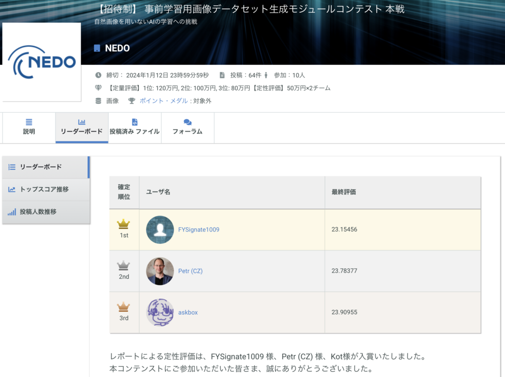

# 事前学習用画像データセット生成モジュールコンテスト 本戦
## 自然画像を用いないAIの学習への挑戦


## コンテストの評価結果
- チーム名 / ユーザ名: askbox
- 予選: 2位 [リーダーボード](https://signate.jp/competitions/1071/leaderboard)
- 本戦: 定量評価部門 3位 [リーダーボード](https://signate.jp/competitions/1073/leaderboard)

[](https://signate.jp/competitions/1073/leaderboard)

## 開発したモジュールの概要
同じ漢字・文字が出現された生成画像は同じクラスと仮定する。

## 2023年「今年の漢字」トップ6: [税, 暑, 戦, 虎, 勝, 球]の生成画像サンプル 

{width="400px"}

## 漢字・文字画像のクラスタリング後1000クラスのサンプル

クラス|c0|c1|c2|c3|c4|c5
-|-|-|-|-|-|-
0|語|餾|脂|諧|諂|謟
1|屩|肩|署|暑|署|署
2|坡|玻|陂|攲|敧|被
3|璜|煐|僙|煐|瑛|磺
...|...|...|...|...|...|...
995|呦|唎|吻|吻|唎|唎
996|涵|涸|凅|湄|涵|滙
997|浦|埔|浦|消|埔|浦
998|雷|雷|罍|畐|皇|皇
999|圸|垝|垉|垉|垉|池

# ディレクトリ構造
```
.
├── LICENSE
├── README.md
├── clustering (漢字・文字画像のクラスタリング)
├── imgs
├── submit (データセット生成)
└── thirds-solution-report.pdf (コンテストレポート)
```


## 関連リンク
[【特別対談】NEDO×AIST　事前学習用画像データセットを自動生成する、学習プロセス革新への挑戦](https://signate.jp/articles/features-dataset-20230825)

[事前学習用画像データセット生成モジュールコンテスト 予選](https://signate.jp/competitions/1071)

[【招待制】 事前学習用画像データセット生成モジュールコンテスト 本戦](https://signate.jp/competitions/1073)


