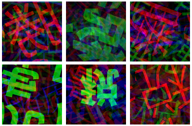
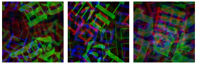

# コンテストの評価結果

## 予選: 2位
順位 | ユーザ名| 暫定評価 | 最終評価
-|-|-|-
1 | Petr (CZ) |  1620.2100000 | 12.7838994
2 | askbox | 1557.1400000 | 13.9381575


## 本戦: 定量評価部門3位
順位 | ユーザ名| 暫定評価 | 最終評価
-|-|-|-
1 | FYSignate1009 | 1088.1100000 | 23.1545619
2 | Petr (CZ) | 1136.7800000 | 23.7837702
3 | askbox | 1134.3200000 | 23.9095506


# 開発したモジュールの概要

## 概要
既存のフラクタル画像を利用せず、独自のアイデアとして同じ漢字・文字が出現された生成画像は同じクラスと仮定する。

## 精度向上のポイント
漢字・文字の画像をクラスタリング処理、各クラスの文字数・各文字の大きさ・描画位置・回転角度・上下左右反転・合成の割合調整等の試行錯誤を重ねる。


# 2023年「今年の漢字」^[トップ6: 税, 暑, 戦, 虎, 勝, 球]の生成画像サンプル 

{width="400px"}


# モジュールのアルゴリズム


## モジュールの開発

1. フェーズ1：漢字・文字の画像のクラスタリング
2. フェーズ2：画像生成


# モジュールのアルゴリズム[フェーズ1]

漢字・文字の画像のクラスタリング

1. 3万以上の漢字・文字の画像^[64x64pixelのグレースケール画像] をVAE^[VAE(Variational Auto-Encoder):変分オートエンコーダー] で100次元に圧縮する。
2. 圧縮した100次元データをk-means法、PCA^[PCA(Principal Component Analysis): 主成分分析] で1000クラスと各クラスが6文字を超えるように調整する。
3. クラスタリングしたデータをcsvファイルに書き出す。


# モジュールのアルゴリズム[フェーズ1]

クラスタリングした1000クラスのサンプル

クラス|c0|c1|c2|c3|c4|c5
-|-|-|-|-|-|-
0|語|餾|脂|諧|諂|謟
1|屩|肩|署|暑|署|署
2|坡|玻|陂|攲|敧|被
3|璜|煐|僙|煐|瑛|磺
...|...|...|...|...|...|...
995|呦|唎|吻|吻|唎|唎
996|涵|涸|凅|湄|涵|滙
997|浦|埔|浦|消|埔|浦
998|雷|雷|罍|畐|皇|皇
999|圸|垝|垉|垉|垉|池


# モジュールのアルゴリズム[フェーズ2]

画像生成

1. 事前にクラスタリングした1000クラスのcsvファイルを読み込む。
2. 各クラスに出現する漢字・文字を抽出する。
3. 抽出した漢字・文字の組み合わせの数を増やすため、RGB各チャンネルに文字の画像を生成する前に下記の項目をランダムに選択する。
    - フォントの種類^[Ubuntu 20.04.6 LTSで使用可能なフォント] ・文字の大きさ
    - 描画位置・回転角度・上下左右反転
4. 生成した画像リストの混合比もランダムに選択する。
5. 生成したRGB画像ファイルを書き出す。


# モジュールのアルゴリズム[フェーズ2]

クラス0^[クラス0: 語, 餾, 脂, 諧, 諂, 謟] による生成画像サンプル
{width="400px"}


# モジュールのアルゴリズム[フェーズ2]

利用したフォント一覧^[Ubuntu 20.04.6 LTSで使用可能なフォント]

```code
NotoSansCJK-Black.ttc NotoSansCJK-Bold.ttc
NotoSansCJK-DemiLight.ttc NotoSansCJK-Light.ttc
NotoSansCJK-Medium.ttc NotoSansCJK-Regular.ttc
NotoSansCJK-Thin.ttc NotoSerifCJK-Black.ttc
NotoSerifCJK-Bold.ttc NotoSerifCJK-ExtraLight.ttc
NotoSerifCJK-Light.ttc NotoSerifCJK-Medium.ttc
NotoSerifCJK-Regular.ttc NotoSerifCJK-SemiBold.ttc
TakaoGothic.ttf TakaoMincho.ttf TakaoPGothic.ttf
TakaoPMincho.ttf ipaexg.ttf ipaexm.ttf
ipag.ttf ipagp.ttf ipam.ttf ipamp.ttf
```


# 考察

3位入賞の要因として、多様な漢字・文字のパターンを活かし、生成した画像の混合比をランダムに調整し、画像処理の組み合わせの数を増やしたことで、画像合成後に多様な拡張画像が生成された。

<!-- subtitle: コンテストレポート -->
<!-- subtitle: 自然画像を用いないAIの学習への挑戦 -->
<!--
github: [github](https://github.com/askbox-net/NEDO-1073)
//-->
